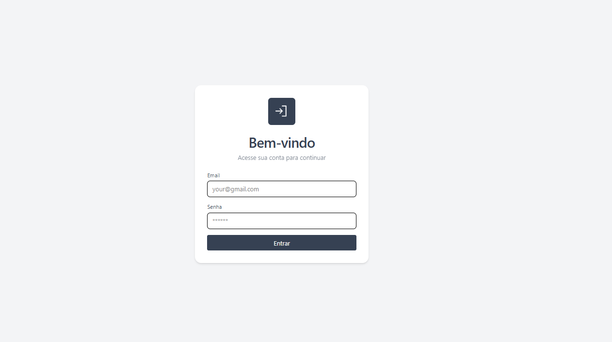
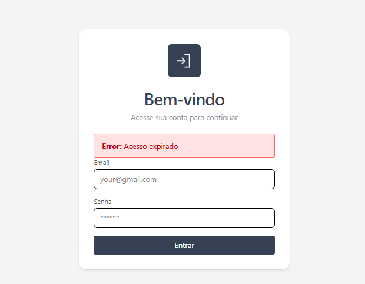
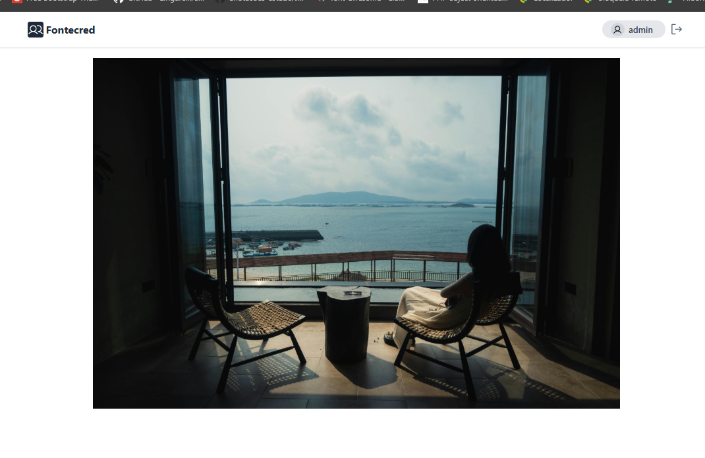
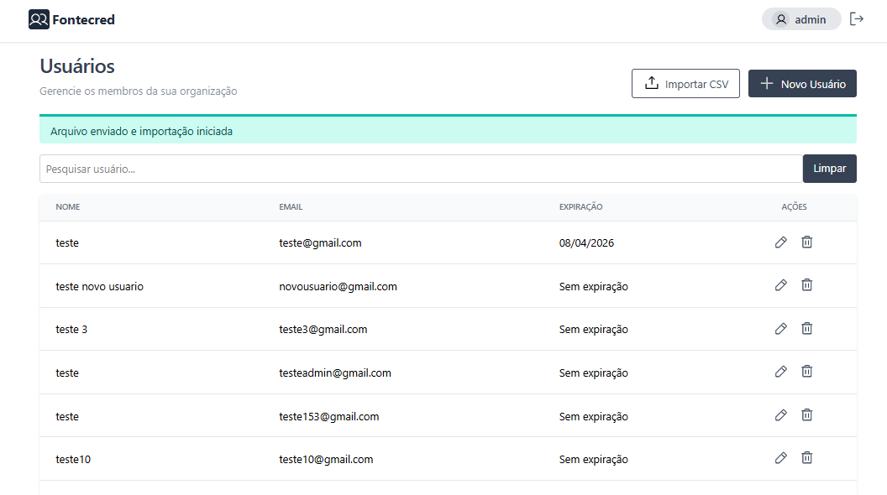
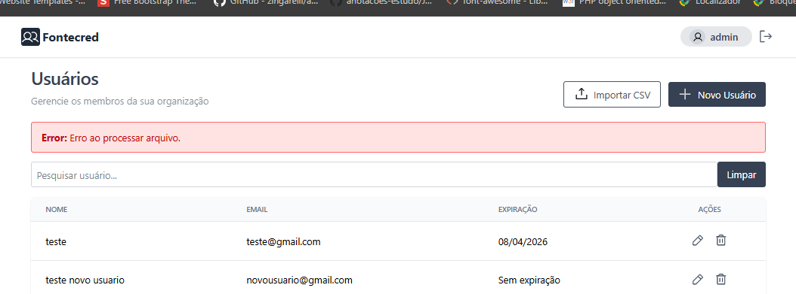
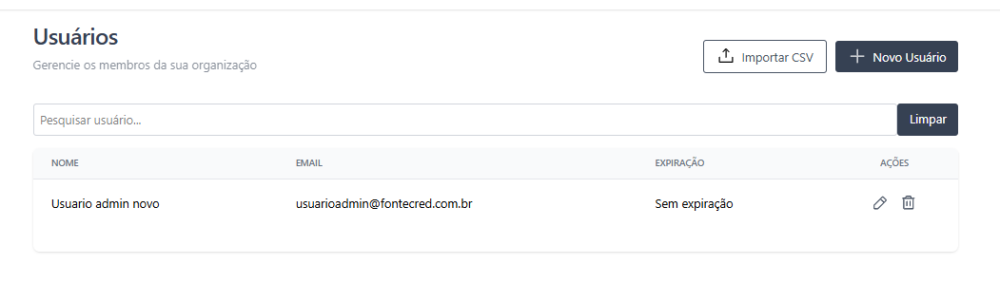
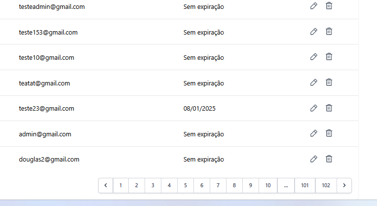
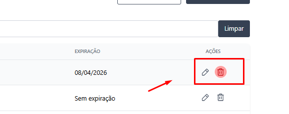
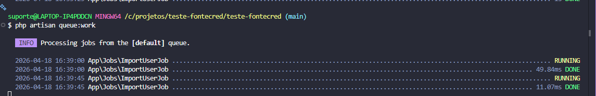

# Teste Técnico – Desenvolvedor PHP (Laravel)

### Requisitos:
- Upload de arquivo CSV
- Processamento em background (Job)
- Permitir uso do sistema durante processamento
- Enviar email ao finalizar
- Se for Admin deve ir para listagem de usuários
- Se não for Admin, deve ir para home

---

## Regras Extras

### Admin automático
- Se email contém `@fontecred.com.br`:
  - `is_admin = true`
- Remover usuários com acesso expirado há mais de 6 meses
---

## Projeto

### Login

---

### Home

---

### Listagem de Usuários

---

### Criar/Editar/Excluir Usuário

---

### Importação CSV
